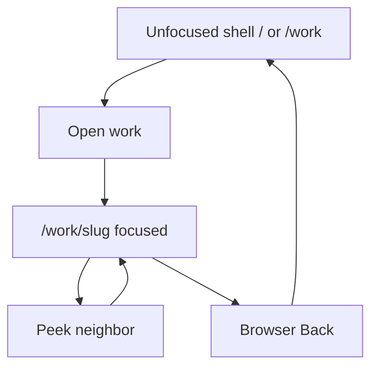
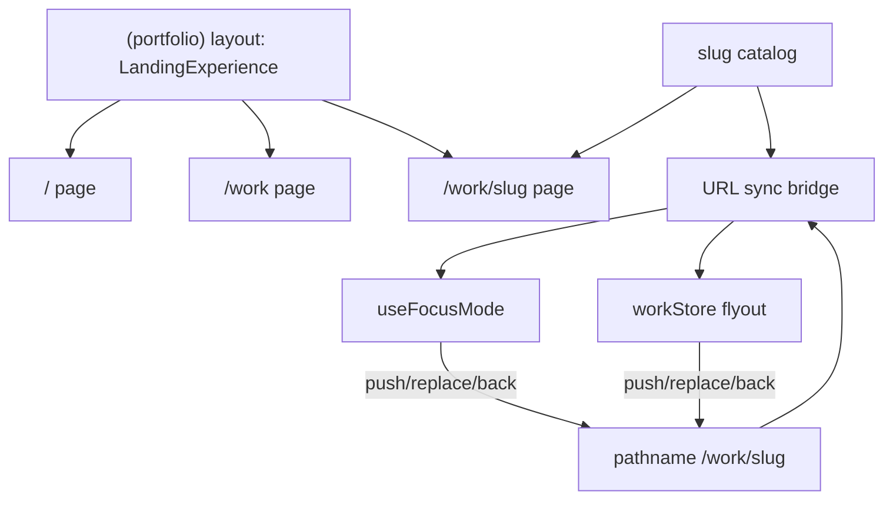
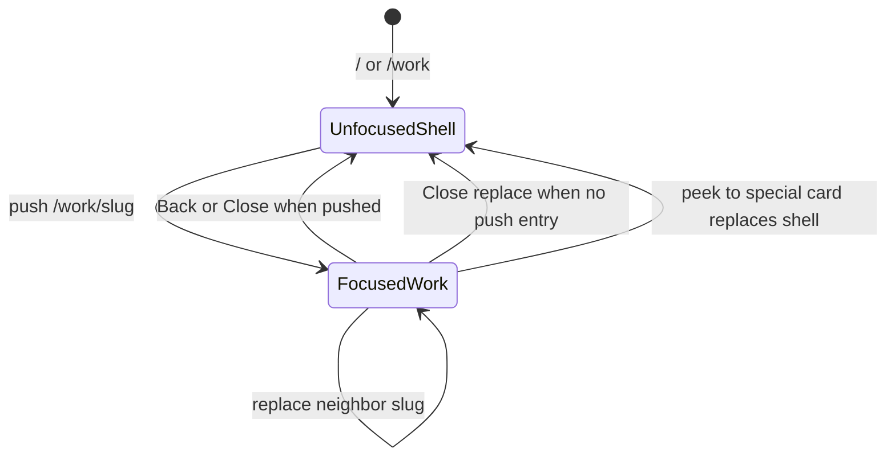

# Work Slug Deep Links - Plan

## Goal Capsule

- **Objective:** Make each portfolio work item addressable at `/work/[slug]` so open/focus is shareable and participates in browser history, while cold loads still land in the home canvas experience with that item focused.
- **Product authority:** This Product Contract (origin `ce-brainstorm`). Planning Contract and Implementation Units below do not change product scope.
- **Product Contract preservation:** Product Contract unchanged.
- **Open blockers:** None.
- **Execution:** `code`

---

## Product Contract

### Summary

Sync canvas focus and reading-mode flyout to `/work/[slug]`. Opening a work pushes history; navigating among focused neighbors replaces. Shared and cold links always open the home canvas with that work focused. Light per-slug metadata and sitemap entries support share previews and basic crawlability.

### Problem Frame

Focus today is in-component React state only. Refresh, share, and Back do not preserve or restore an open work. The portfolio already has many works, but they are not addressable pages. Callers want shareable URLs and real history without turning the site into a separate project-detail section.

### Key Decisions

- **Primary goals are share/bookmark and browser history; SEO is secondary but in v1 as light metadata.** (session-settled: user-directed — chosen over SEO-first: share and Back matter more than crawl depth)
- **Cold load of `/work/[slug]` always opens the home canvas with that item focused**, not a dedicated detail page and not reading flyout. (session-settled: user-directed — chosen over dedicated page / hybrid SSR page: keep the portfolio feel)
- **History: open pushes; neighbor peek replaces.** One Back exits focus. (session-settled: user-approved — chosen over full push stack or replace-only: avoids Back spam while still closing focus via Back)
- **URL shape is `/work/[slug]`.** (session-settled: user-directed — chosen over `/p/[slug]` or query params: reads as real work pages)
- **`/` is the canvas shell; `/work/[slug]` is that shell with focus.** Bare `/work` is the same shell, unfocused — not a thinner alternate canvas. (session-settled: user-approved — chosen over dual experiences or hard redirect-only: one product surface)
- **Canvas focus and reading flyout share the same `/work/[slug]` scheme; special cards stay out.** (session-settled: user-directed — chosen over work-only or work+special-cards: one URL per work across view modes)
- **Unknown slug soft-lands on the unfocused canvas** (no hard 404 page). (session-settled: user-approved — chosen over hard 404: keep people in the portfolio)
- **Light SEO in v1:** per-slug title/description, basic OG, sitemap entries. (session-settled: user-approved — chosen over URLs-only or defer: OG serves share previews)

### Requirements

**Addressability**

- R1. Every portfolio work has a stable slug used in `/work/[slug]`.
- R2. Opening a work in canvas focus updates the URL to `/work/[slug]`.
- R3. Opening a work in the reading-mode flyout updates the URL to the same `/work/[slug]`.
- R4. Closing focus or flyout returns the URL to the unfocused shell path for the session (`/` or `/work`).

**History**

- R5. First open of a work from an unfocused shell pushes a history entry.
- R6. Moving to another work while already focused (e.g. neighbor peek) replaces the current history entry rather than stacking.
- R7. Browser Back from a focused `/work/[slug]` returns to the prior unfocused shell and closes focus/flyout.
- R8. Browser Forward re-opens the corresponding work in canvas focus when that history entry is a work slug (cold-load rule still applies on full reload).

**Cold load and shells**

- R9. Visiting `/work/[slug]` for a known work loads the home canvas experience with that work already focused.
- R10. Visiting `/work` (no slug) loads the same home canvas experience with no work focused.
- R11. Visiting `/work/[slug]` for an unknown slug loads the unfocused home canvas (soft-land); it must not present a dedicated error page as the primary outcome.

**Out of band**

- R12. Origin, listening, and CoverFlow album states do not get `/work/[slug]` deep links in this scope.
- R13. Each known work slug has a unique document title and description suitable for sharing, basic Open Graph tags, and a sitemap entry.

### Key Flows

- F1. Open from canvas
  - **Trigger:** User clicks a work tile on `/` or `/work`.
  - **Steps:** Focus opens; URL pushes to `/work/[slug]`.
  - **Outcome:** Shareable focused URL; Back closes focus to the prior shell.

- F2. Peek neighbors while focused
  - **Trigger:** User navigates to another focused neighbor.
  - **Steps:** Focus moves; URL replaces to the new `/work/[slug]`.
  - **Outcome:** URL matches current work; Back still exits focus once.

- F3. Open from reading flyout
  - **Trigger:** User opens a work in reading mode.
  - **Steps:** Flyout opens; URL pushes from an unfocused shell (R5) or replaces when a work is already focused/open (R6).
  - **Outcome:** Same `/work/[slug]` as canvas; cold load of that URL still opens canvas+focused (not flyout).

- F4. Shared / cold link
  - **Trigger:** User opens `/work/[slug]` in a new session or after refresh.
  - **Steps:** Home canvas loads; known slug focuses that work; unknown slug soft-lands unfocused.
  - **Outcome:** Recipient sees the portfolio canvas, not a separate detail site.

### Acceptance Examples

- AE1. Share from canvas
  - **Covers:** R2, R5, R9
  - **Given:** User is on `/` with no focus
  - **When:** They open Aquariux, copy the URL, and open it in a new tab
  - **Then:** The new tab shows the home canvas with Aquariux focused at `/work/<aquariux-slug>`

- AE2. Back closes once after peeks
  - **Covers:** R5, R6, R7
  - **Given:** User opens work A, then peeks to B and C
  - **When:** They press Back once
  - **Then:** Focus closes and URL returns to the unfocused shell; they are not forced through B then A

- AE3. Reading writes URL; cold load stays canvas
  - **Covers:** R3, R9
  - **Given:** User is in reading mode and opens a work flyout
  - **When:** URL is `/work/[slug]` and a recipient opens that link cold
  - **Then:** Recipient lands on canvas+focused, not the reading flyout

- AE4. Unknown slug
  - **Covers:** R11
  - **Given:** User visits `/work/not-a-real-project`
  - **When:** The page loads
  - **Then:** Home canvas appears unfocused; no dedicated 404 page is the primary UI

- AE5. Bare work index
  - **Covers:** R10
  - **Given:** User visits `/work`
  - **When:** The page loads
  - **Then:** Same home canvas shell as `/`, with no work focused

### Success Criteria

- A focused work’s URL can be pasted into another browser and restores canvas+focused for that work.
- Back after an open+peek session exits focus in one step.
- Shared links show a sensible title/OG preview (not a generic site-only card) for known works.
- Special cards and CoverFlow remain URL-unchanged.

### Scope Boundaries

**In scope**

- Work slug addressability for canvas focus and reading flyout
- History push/replace rules above
- Soft-land unknown slugs
- Unify bare `/work` with the home canvas shell
- Light per-slug SEO (title, description, OG, sitemap)

**Deferred for later**

- Deep links for origin, listening, CoverFlow albums
- Heavy SEO (structured data, standalone article bodies)
- Preserving sender view mode (reading vs canvas) on cold load

**Outside this change’s identity**

- Replacing the infinite canvas with a conventional multi-page case-study site

### Dependencies / Assumptions

- Slugs can be derived stably from existing work identity (`name` / key); exact derivation rules are a planning detail.
- Work external `url` fields remain outbound project links, not internal path slugs.
- Grid seat IDs (`item_x_y`) are not used as URL identity.

### Outstanding Questions

**Resolve Before Planning**

- None.

**Deferred to Implementation**

- Whether slug lives as an optional field on `Work` vs a parallel catalog map only (module path default: `src/lib/workSlug.ts`).

### Sources / Research

- Canvas focus is React state in focus mode; no URL sync today (`src/components/InfiniteCanvas/focus/useFocusMode.ts`).
- App Router has static `/work` only; no `/work/[slug]` yet (`src/app/work/page.tsx`).
- `Work` has `name` + optional external `url`; no `slug` field; identity helper uses `url ?? name` (`src/components/InfiniteCanvas/grid/gridMath.ts`).
- Sitemap currently lists `/` only (`src/app/sitemap.ts`).
- `/` hosts `LandingExperience` (origin + listening); `/work` mounts a thinner canvas without those extras — this plan collapses that split for the shell.
- No institutional learnings corpus (`docs/solutions/` absent).
- Next.js 15.5 App Router guidance: keep canvas in a layout above `[slug]` so soft navigation does not remount; prefer URL as source of truth for focus; use `push`/`replace`/`back` rather than dual `popstate` listeners.

---

## Planning Contract

### Key Technical Decisions

- **KTD1. Shared `(portfolio)` layout owns the canvas shell.** Put `LandingExperience` (or equivalent client island) in a route-group layout above `/`, `/work`, and `/work/[slug]` so soft nav between shell and slug does not remount the canvas. (session-settled: user-approved — chosen over mounting `LandingExperience` in each page: remount risk on slug change) — inherits Product Contract shell decision.
- **KTD2. URL is source of truth for addressable focus.** Pathname drives focus/flyout apply; gestures call `router.push` / `router.replace` / `router.back`. Avoid parallel custom `popstate` control loops.
- **KTD3. Slug identity is kebab-cased work `name`, never outbound `url` or grid seat id.** Build a catalog from `WORK_HISTORY` with collision checks; exclude Hello / Now listening. Do not reuse `getWorkKey` for paths.
- **KTD4. Close / Escape uses `history.back()` when the current entry was a pushed focus; otherwise replace to the session shell (`/` or `/work`).** (session-settled: user-approved — chosen over always-replace: always-replace leaves `/work/slug` under the stack so Back reopens)
- **KTD5. Unknown slugs soft-land and keep `/work/bad-slug` in the address bar.** Do not call `notFound()` for unknown work slugs. Optional `robots: noindex` for unknown is fine; primary UI stays unfocused canvas. (session-settled: user-approved — chosen over rewrite to `/` or `/work`: preserves what was requested)
- **KTD6. Cold load forces canvas for that navigation.** On `/work/[slug]` (known or unknown) and bare `/work`, force `viewMode: 'canvas'` for the load so reading localStorage cannot unmount the canvas; leave stored preference intact for later toggles.
- **KTD7. Queue programmatic focus until intro + layout are ready.** Deep links must not skip intro; they wait for the existing intro gate, then ensure/find a seat for the work and open focus.
- **KTD8. Special-card peeks replace to the unfocused shell URL.** When neighbor navigation lands on Hello / listening / custom cards, replace URL to `/` or `/work` (session shell); never invent special-card slugs. Resume `/work/[slug]` replace when peeking back to a normal work.
- **KTD9. Info flyouts never write work URLs.** URL sync applies to canvas work focus and reading flyouts with work type only; Header/Contact `type: 'info'` selections are ignored by the bridge.
- **KTD10. OG image prefers the work image (or thumbnail), falling back to site default.** Title/description derived from work `name` / `description`.
- **KTD11. Nav active states (if Navigation is re-enabled):** Home active only on `/`; Work active on `/work` and `/work/*`.

### Assumptions

- Soft-land unknown slugs intentionally returns a successful page experience (not the site `not-found` UI), accepting weaker crawl signals for junk URLs in exchange for portfolio continuity.
- No automated test harness exists today; verification for this feature is manual smoke against AE1–AE5 plus `lint`/`build`.
- Intercepting routes / `@modal` are unnecessary because cold and soft nav should show the same canvas+focus experience.

### High-Level Technical Design

### Sequencing

1. U1 slug catalog (unblocks routes, SEO, sync)
2. U2 portfolio route shell (unblocks cold load surface)
3. U3 focus-by-slug + intro queue (unblocks R9)
4. U4 URL sync bridge (R2–R8, F1–F3)
5. U5 metadata + sitemap (R13)

### System-Wide Impact

- **Surfaces:** Home canvas focus (`useFocusMode`), reading flyout (`workStore`), portfolio view mode (`portfolioViewStore`), App Router pathname, site metadata/sitemap.
- **Failure modes:** Sync loops between pathname apply and gesture writers; intro gate dropping cold-load focus; reading localStorage unmounting canvas on deep link; info flyouts fighting work URL writers; special-card peeks inventing or retaining bad slugs.
- **Parity:** Canvas open and reading work-flyout open must mint the same `/work/[slug]`; cold load always prefers canvas+focus over flyout.
- **Nav:** If dormant Navigation returns, active-state rules in KTD11 prevent `/` and `/work/*` fighting each other.

### Risks & Dependencies

| Risk | Mitigation |
|------|------------|
| Canvas remount on slug change loses camera/focus mid-gesture | KTD1 shared `(portfolio)` layout above `[slug]` |
| Close replace leaves focused URL under Back stack | KTD4 back-when-pushed |
| Soft-land junk URLs are indexable | Keep soft-land UI; `noindex` + omit from sitemap (KTD5, U5) |
| Dual writers (focus + flyout) diverge | Single bridge owns push/replace/back; info flyouts excluded (KTD9) |
| No automated tests | Manual AE smoke + lint/build gates in Verification Contract |

---

## Implementation Units

### U1. Work slug catalog

- **Goal:** Stable slug ↔ work lookup for routes, sync, and SEO.
- **Requirements:** R1, R12
- **Dependencies:** None
- **Files:**
  - create: `src/lib/workSlug.ts` (or equivalent under an existing util folder)
  - modify: `src/fixture/Work.fixture.tsx` only if an explicit slug field is chosen over derived mapping
  - test: none required if pure helpers are exercised via U5/U4 smoke; optional `src/lib/workSlug.test.ts` only if a runner is introduced
- **Approach:** Derive kebab-case slugs from work `name`; assert uniqueness across `WORK_HISTORY`; expose `getWorkBySlug`, `getSlugForWork`, and `ALL_WORK_SLUGS`. Exclude origin/listening. Never use outbound `url` or `getWorkKey` as the path slug. Cite KTD3.
- **Patterns to follow:** Fixture ownership in `src/fixture/Work.fixture.tsx`; keep external `url` as outbound links.
- **Test scenarios:**
  - Happy path: known names map to stable kebab slugs and round-trip via `getWorkBySlug`.
  - Edge: two names that would collide after slugify are detected (fail fast in catalog build or explicit disambiguation).
  - Edge: Hello / Now listening are absent from `ALL_WORK_SLUGS`.
- **Verification:** Catalog lists every active `WORK_HISTORY` entry exactly once; no external URLs appear as slugs.

### U2. Portfolio route shell

- **Goal:** One canvas shell for `/`, `/work`, and `/work/[slug]` without remounting on soft slug changes.
- **Requirements:** R9, R10, R11
- **Dependencies:** U1
- **Files:**
  - create: `src/app/(portfolio)/layout.tsx`
  - create/move: `src/app/(portfolio)/page.tsx` (home)
  - create/move: `src/app/(portfolio)/work/page.tsx`
  - create: `src/app/(portfolio)/work/[slug]/page.tsx`
  - modify/remove: legacy `src/app/page.tsx`, `src/app/work/page.tsx` as relocated
  - modify: `src/components/LandingExperience/LandingExperience.tsx` as needed to accept initial slug / shell props
- **Approach:** Route-group layout hosts `LandingExperience`. Thin `[slug]` page validates against catalog for metadata consumers but does not own the canvas. Unknown slug still renders the shell (no `notFound()`). Bare `/work` uses the same shell unfocused. Cite KTD1, KTD5.
- **Execution note:** Prefer runtime smoke of soft nav `/` → `/work/x` → `/work/y` and confirm canvas does not fully remount (state/camera continuity).
- **Patterns to follow:** Existing `LandingExperience` composition on home; CSR canvas via `InfiniteCanvasCSR`.
- **Test scenarios:**
  - Covers AE5. Visit `/work` shows home shell with origin/listening available, unfocused.
  - Covers AE4. Visit `/work/not-a-real-project` shows unfocused shell (not `not-found` page).
  - Integration: soft navigate between two known slugs without full page reload of the shell.
- **Verification:** `/`, `/work`, and `/work/[known]` all present the rich home experience; unknown slug soft-lands.

### U3. Focus-by-slug and cold-load apply

- **Goal:** Programmatically open a work in focus from a slug after intro/layout readiness; force canvas on deep links.
- **Requirements:** R8, R9, R11
- **Dependencies:** U1, U2
- **Files:**
  - modify: `src/components/InfiniteCanvas/focus/useFocusMode.ts`
  - modify: `src/components/InfiniteCanvas/InfiniteCanvas.tsx`
  - modify: `src/components/LandingExperience/LandingExperience.tsx`
  - modify: `src/store/portfolioViewStore.ts` only if a one-shot force-canvas API is cleaner than a prop
- **Approach:** Add imperative open-by-work/slug that finds or ensures a seat, then opens focus. Queue until intro gate clears and view is ready. On `/work/[slug]` and bare `/work`, force canvas for the load without permanently rewriting localStorage preference. Unknown slug applies unfocused. Cite KTD6, KTD7.
- **Patterns to follow:** Existing `handleItemClick` / intro gating in `useFocusMode`.
- **Test scenarios:**
  - Covers AE1. Cold load known slug ends in canvas+focused after intro.
  - Edge: localStorage `reading` does not prevent canvas+focus on cold `/work/[slug]`.
  - Edge: unknown slug remains unfocused after intro.
  - Edge: Forward to a slug re-applies canvas focus (R8).
- **Verification:** Deep links reliably focus after intro; reading preference still works when toggling after landing.

### U4. URL sync bridge (focus + flyout)

- **Goal:** Keep pathname and focus/flyout aligned with push/replace/back rules.
- **Requirements:** R2–R8, R12; F1–F3
- **Dependencies:** U1, U2, U3
- **Files:**
  - create: `src/components/LandingExperience/workUrlSync.ts` (or hook colocated with LandingExperience)
  - modify: `src/components/InfiniteCanvas/focus/useFocusMode.ts` (emit open/peek/close intents)
  - modify: `src/components/Flyout/Flyout.tsx` and/or `src/store/workStore.ts` / `ReadingPortfolio.tsx`
  - modify: `src/components/LandingExperience/LandingExperience.tsx` to mount the bridge
- **Approach:** Pathname → apply focus/clear. Open from unfocused → `push`. Neighbor peek → `replace`. Close/Escape → `back` when pushed, else `replace` to session shell. Reading work flyout writes the same URLs; info flyouts ignored. Special-card focus replaces to shell URL. Prevent sync loops (gesture vs apply). Cite KTD2, KTD4, KTD8, KTD9.
- **Patterns to follow:** Next.js App Router `useRouter` / `usePathname`; existing focus and flyout close timings.
- **Test scenarios:**
  - Covers AE2. Open A, peek B, peek C, Back once → unfocused shell.
  - Covers AE3. Reading flyout sets `/work/[slug]`; cold load of that URL opens canvas+focused, not flyout.
  - Happy path: canvas open from `/` pushes `/work/[slug]`; Close returns via back to `/`.
  - Edge: deep-linked `/work/[slug]` Close replaces to shell (no prior push entry) without leaving the site incorrectly when possible.
  - Edge: info flyout open/close does not change work slug URL.
  - Edge: peek onto listening/Hello replaces to unfocused shell URL.
- **Verification:** Manual history walks match AE2; reading and canvas share slugs; specials/info never mint work URLs.

### U5. Per-slug metadata and sitemap

- **Goal:** Light SEO and share previews for known works.
- **Requirements:** R13
- **Dependencies:** U1, U2
- **Files:**
  - modify: `src/app/(portfolio)/work/[slug]/page.tsx` (`generateMetadata`)
  - modify: `src/app/sitemap.ts`
  - reference: `src/app/layout.tsx` site defaults for OG fallback
- **Approach:** `generateMetadata` for known slugs (title, description, canonical, OG image per KTD10). Unknown slug: unfocused shell UI with `robots: noindex` acceptable. Extend sitemap with all `ALL_WORK_SLUGS`. Canvas remains CSR; metadata is route-level.
- **Patterns to follow:** Existing `metadata` / `BASE_URL` in `src/app/layout.tsx` and `src/app/sitemap.ts`.
- **Test scenarios:**
  - Happy path: known slug document title includes work name; OG image resolves to work media or site default.
  - Happy path: sitemap includes `/` and each `/work/[slug]`.
  - Edge: unknown slug is not listed in sitemap and is noindex if metadata runs.
- **Verification:** View source / Next metadata for a known slug shows unique title/description; `/sitemap.xml` lists work URLs.

### Deferred to Follow-Up Work

- Special-card and CoverFlow deep links
- Heavy SEO / structured data / SSR case-study bodies
- Introducing a first-class unit test runner for the repo
- Re-enabling dormant `Navigation` beyond active-state rules already decided in KTD11

---

## Verification Contract

| Gate | What it proves | When |
|------|----------------|------|
| Manual AE1–AE5 smoke | Product acceptance examples | After U3–U5 wired |
| Soft-nav remount check | Canvas shell survives `/work/a` ↔ `/work/b` | After U2+U4 |
| History walk | Push open / replace peek / Back once | After U4 |
| `npm run lint` | No new lint regressions | Before handoff |
| `npm run build` | Routes/metadata compile; sitemap generates | Before handoff |

No automated unit/e2e suite exists in-repo; do not invent CI test commands that are not present.

---

## Definition of Done

- All Implementation Units U1–U5 complete against their verification bullets.
- AE1–AE5 pass manually on desktop; neighbor peek + Back checked on at least one mobile-width path if swipe peek is used.
- Product Contract requirements R1–R13 satisfied; R12 exclusions hold (no special-card URLs).
- `lint` and `build` succeed.
- Plan-ready for `ce-work` / `/goal` without unresolved blocking questions.
